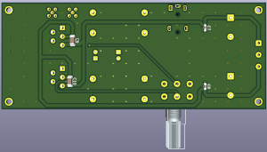

# Music amplifier on TDA2050:  
A simple two-channel amplifier on a chip TDA2050.  

### Schemes:  
###### ma_tda2050_v0.1:  
[pdf](docs/ma_tda2050_v0.1.pdf)  

### Images:  
###### ma_tda2050_v0.1:  
top:  
  
bottom:  
  

###### gerber:  
Archive for production:  
[ma_tda2050_v0.1](https://github.com/piro-s/ma_tda2050/raw/main/gerber/ma_tda2050_v0.1.zip)  